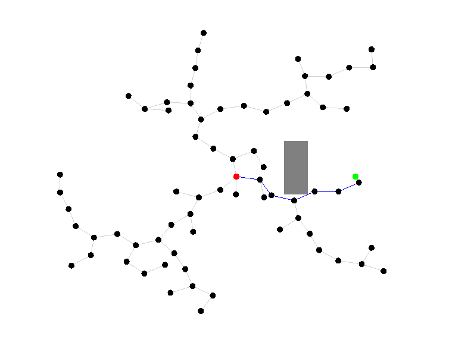

# rrt-fpga

I'm making a hardware implementation of the classic [RRT algorithm](https://en.wikipedia.org/wiki/Rapidly_exploring_random_tree)
to learn Verilog and hardware design!

So far, I have built a [simple visualization](app/src/main.rs) and a [CPU implementation](rrt/src/cpu/vanilla.rs) in Rust.
The [Verilog implementation](rrt/src/fpga/verilog) is in progress!

